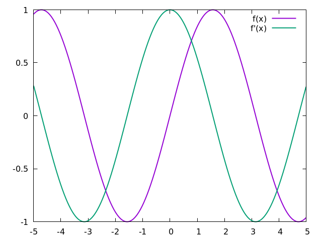
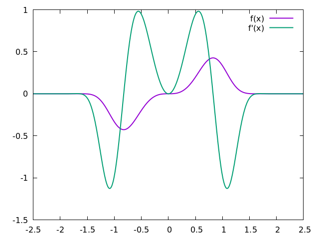

# Basic Numerical Differentiation Using C

A simple script using `c programming language` to perform a numerical differentiation on 
any function (e.g `sin`, `cos`, `exp(-x^2)`, or `sin(x)*exp(-x)`) and much more.

## Build 
```sh
$ make clean
$ make all
```

## Info
in `inc/function.h` you can the `f(x)` to you own function with some contrains:
 1. the function name should be `(f)`.
 2. the function only take one parameter which `x` as `f(x)`
 3. the function parameter and return value of type `(dtype)`

## Run
```sh
$ ./bin/NumericalDiff.exe
```

## Sample Output
```
#      x      f(x)      f'(x)
-5.00000   0.95892    0.28366   
-4.99000   0.96171    0.27406   
-4.98000   0.96441    0.26443   
-4.97000   0.96700    0.25477   
-4.96000   0.96950    0.24509   
...        ...        ...
4.96000    -0.96950   0.24509   
4.97000    -0.96700   0.25477   
4.98000    -0.96441   0.26443   
4.99000    -0.96171   0.27406   
```

## Visualize the Output Data
```
$ gnuplot -p plot.gn
```

## Sample Output



